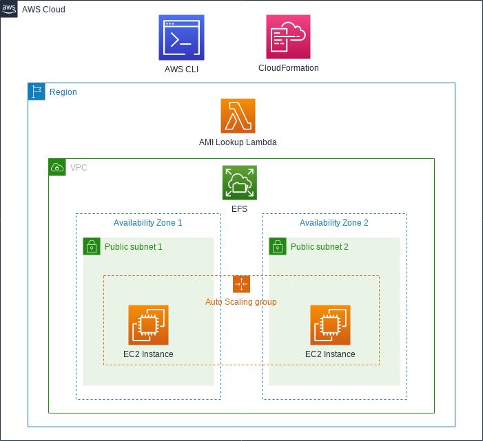
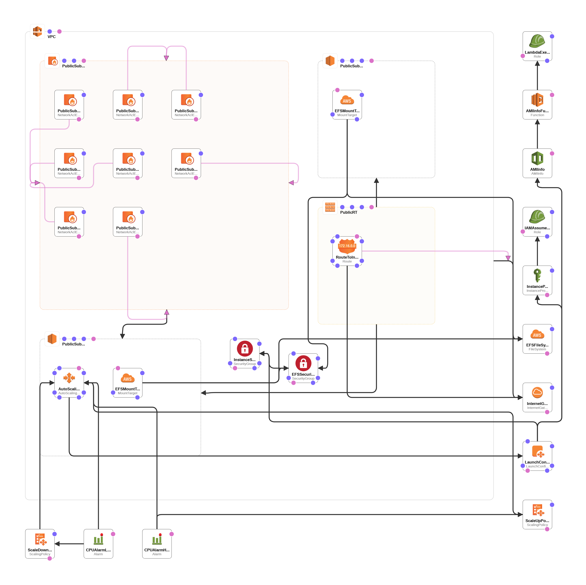

# aws-efs-automount-amilookup

`aws-efs-automount-amilookup` demonstrates the creation of an [Amazon Elastic File System](https://aws.amazon.com/efs/) instance. [Amazon EC2](https://aws.amazon.com/ec2/) instances which are created as part of an Auto Scaling Group are configured to automatically mount the EFS instance on boot.

In addition, a [Lambda](https://aws.amazon.com/lambda/) function is provided in order to dynamically lookup the AMI Image Id of specific instance types in order to avoid hard-coding AMI image Id's within the [CloudFormation](https://aws.amazon.com/cloudformation/) template.

The project draws heavily on the EFS Automount example provided within the [AWS CloudFormation Template](https://github.com/awslabs/aws-cloudformation-templates/blob/master/community/services/EFS/efs_with_automount_to_ec2.json) project.

The project uses ideas and code provided in the [Looking Up Amazon Machine Image IDs walkthrough](https://docs.aws.amazon.com/AWSCloudFormation/latest/UserGuide/walkthrough-custom-resources-lambda-lookup-amiids.html) as provided by Amazon.

# Architecture

The project architecture is shown below.



The diagram generated by the CloudFormation Designer is provided for additional reference below:



# Prerequisites

* An AWS account with appropriate permissions to create the required resources
* [AWS CLI installed and configured](https://docs.aws.amazon.com/cli/latest/userguide/install-cliv1.html)
* Bash environment in which to execute the scripts

# Deploy the project

## Grab the project 

The first step is to git clone the project.

```bash
git clone --verbose --progress https://github.com/damianmcdonald/aws-efs-automount-amilookup aws-efs-automount-amilookup
```

## Configure global variables

The second step is to modify any of the global variables to suit your needs.

The global variables are defined in the [aws-deploy.sh](aws-deploy.sh) script.

You will need to update the `AWS_PROFILE` variable to reflect the profile that you have configured in the AWS CLI.

For the remaining global variables, if you just want to have a sandbox environment to experiment with the project then the defaults below are probably fine.

```bash
# Global variable declarations
PROJECT_DIR=$PWD
SLEEP_TIME=15
AWS_PROFILE=<!-- ADD_YOUR_AWS_CLI_PROFILE_HERE -->
AWS_REGION=$(aws configure get region --output text --profile ${AWS_PROFILE})
IAM_CAPABILITIES=CAPABILITY_NAMED_IAM
STACK_NAME=efs-automount-amilookup
CFN_STACK_TEMPLATE=stack-template.yml
S3_LAMBDA_BUCKET=${STACK_NAME}-${RANDOM}
S3_LAMBDA_KEY=functions/amilookup.zip
LAMBDA_PACKAGE=${PROJECT_DIR}/${S3_LAMBDA_KEY}
KEY_PAIR_NAME=${STACK_NAME}
UNDEPLOY_FILE=aws-undeploy.sh
```

## Create the resources and deploy the project

Create the resources and deploy the project by executing the [aws-deploy.sh](aws-deploy.sh) script.

```bash
./aws-deploy.sh
```

The project is deployed using a [CloudFormation template](stack-template.yml) . You can follow the progress of the project creation using the AWS CloudFormation console.

As part of the execution of the [aws-deploy.sh](aws-deploy.sh) script, one additional file is dynamically created.

Location | Purpose
------------ | -------------
aws-undeploy.sh | Script that can be used to destroy and clean-up all of the resources created by the `aws-cognito-authentication-s3` project

# Test the project

Once the CloudFormation stack has been created successfully, you can test that the EC2 instances have automounted the EFS instance.

The output of the [aws-deploy.sh](aws-deploy.sh) script presents you with the list of public IP addresses of the EC2 instances that you can use to connect to the EC2 machines.

1. Select the public IP address of an EC2 instance
2. SSH to the instance; ssh -i ${KEY_PAIR_NAME}.pem ec2-user@${EC2_PUBLIC_IP}
3. Verify that the EFS share has been mounted and is writeable; cat /mnt/efs/hello-world.txt